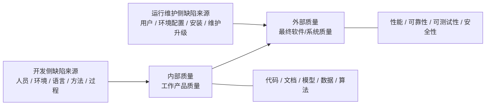

# 第0章 软件质量保障概述

## 0.1 本章定位

本章是全课程的概念基础，说明为什么要做软件质量保障、软件质量如何评估、缺陷为什么是质量问题的核心，以及软件全方位缺陷检测有哪些主流方法。后续软件度量、软件测试、回归测试、性能测试都属于质量保障方法体系中的具体技术。

## 0.2 核心概念

### 软件

- 软件是按照特定顺序组织的计算机指令和数据的集合。
- 简化表达：软件 = ==程序 + 数据 + 文档==。
- 软件三种类型：编程语言，基础软件（开发或运维软件），应用软件（特定领域软件）
- 核心关注点：产品能力，产品质量，开发和运维成本，开发效率

### 软件质量

软件质量是软件与==明确地定义的需求和隐含定义的需求==相一致的程度。

### 软件质量保障

软件质量保障包含==管理和技术==两个方面，也包含先验方法和后验方法。

- 管理：ISO、CMMI、4P Model 等。
- 技术：分析、测试、监控、模拟等。

### 软件质量模型

质量模型包括 McCall、Boehm、FURPS/FURPS+、Dromey、ISO/IEC 9126、ISO/IEC 25010 等。

 ==ISO/IEC 25010 八个主要特性==：功能性、可靠性、易用性、可维护性、性能效率、安全性、可移植性、兼容性。

| ISO/IEC 25010 特性 |
| ---- |
| 功能性 |
| 可靠性 |
| 易用性 |
| 可维护性 |
| 性能效率 |
| 安全性 |
| 可移植性 |
| 兼容性 |

### 软件全生命周期质量保障

软件全生命周期质量保障包含两种类型

- ==单生命周期软件质量保障==；
- ==多生命周期软件质量保障==。

全生命周期软件质量如何保证？

| **方式** | **含义**            | **代表内容**                                         |
| -------- | ------------------- | ---------------------------------------------------- |
| 先验方法 | 加强管理            | Formal Specification、SPI、Architecture、CMM、TQM 等 |
| 后验方法 | 技术创新 / 缺陷检测 | Testing、Simulation、Analysis、Measurement 等        |

通常情况下，软件质量包含：内部质量和外部质量两种

- ==内部质量：工作产品的质量==；
- ==外部质量：最终软件产品的质量==。




### 软件缺陷

软件缺陷常被称为 Bug。是计算机软件或程序中存在的某种**破坏正常运行能力的问题、错误，或者隐藏的功能缺陷**。

**缺陷的存在会导致软件产品在某种程度上不能满足用户的需要**。

课件引用 IEEE729-1983 的思想：从产品内部看，缺陷是软件产品开发或维护过程中存在的错误、毛病等各种问题；从产品外部看，缺陷表现为系统不能满足用户需要的某种失效。

重要判断：

- 软件缺陷是导致软件质量差的重要原因。
- 软件缺陷不可避免。
- 缺陷越早发现，修复代价越小；越晚发现，修复代价越大。

#### 软件缺陷的表现形式

- 错误：错误的算法、错误的模型、错误的代码、错误的公式、错误的单位等；
- 复杂度高：难以理解、不易修改、不易维护；
- Bad Smell：不良设计或不良代码味道；
- 代码冗余：多余代码、重复代码；
- 不可行路径：程序中永远不会被执行的路径；
- 其他相关概念：Defect、Bug、Flaw、Error、Fault、Technical Debt、Weakness、Vulnerability 等。

#### 软件缺陷的分布位置

软件缺陷不只存在于源代码中，也可能存在于软件生命周期的各种工作产品中：

| 缺陷可能位置 | 具体例子                     |
| ------------ | ---------------------------- |
| 需求文档     | 应用需求文档、软件需求文档   |
| 设计文档     | 架构设计、模块设计、算法设计 |
| 实现产物     | 源代码、数据、模型           |
| 测试文档     | 测试计划、测试用例、测试脚本 |
| 维护文档     | 运维、维护、升级相关文档     |

必会判断：

- 软件缺陷只存在于源代码中：错。
- 测试计划、测试用例、测试脚本中也可能存在缺陷：对。


## 0.3 软件全方位缺陷检测主流方法

### 软件全方位缺陷检测的总体理解

软件全方位缺陷检测不是只检查源代码，也不是只做测试，而是围绕软件生命周期中的不同阶段、不同对象，使用多种技术手段发现软件中可能存在的缺陷。

检测对象包括：需求文档；设计文档；模型；数据；算法；源代码；测试文档；运行中的软件系统。

从质量角度看，软件缺陷检测既可以关注内部质量，也可以关注外部质量。

| 质量类型 | 关注对象                               | 典型关注点                                                   |
| -------- | -------------------------------------- | ------------------------------------------------------------ |
| 内部质量 | 代码、文档、模型、数据、算法等工作产品 | 可读性、可理解性、可维护性、可控制性、无死锁、易出错性、活性等 |
| 外部质量 | 最终软件 / 系统                        | 性能、可靠性、可测试性、安全性、安全保障等                   |

软件缺陷检测方法可以从多个角度理解：

| 分类角度         | 典型类型                 |
| ---------------- | ------------------------ |
| 是否运行程序     | 静态方法、动态方法       |
| 是否依赖程序结构 | 白盒方法、黑盒方法       |
| 是否依赖数学模型 | 形式化方法、非形式化方法 |
| 是否依赖人工智能 | 传统方法、智能化方法     |
| 检测范围         | 局部检测、整体检测       |

---

### 软件缺陷检测的 9 种主流方法

==软件缺陷检测 9 种主流方法：评审、分析、度量、验证、仿真、测试、监测、基于知识、智能化方法。==

| 方法         | 核心含义                                                     | 典型适用场景                       |
| ------------ | ------------------------------------------------------------ | ---------------------------------- |
| 评审方法     | 利用走查、检查单、审计、代码阅读等方式进行人工或自动评审，发现规范性、完整性、一致性、冗余等方面的缺陷 | 需求文档、设计文档、代码、测试文档 |
| 分析方法     | 从控制流分析、数据流分析、代码坏味道检测、修改影响分析、路径剖析等角度进行代码层面的缺陷检测 | 源代码、中间码、二进制码           |
| 度量方法     | 通过度量设计和代码的好坏，发现设计和代码缺陷                 | 模块结构、复杂度、耦合、内聚等     |
| 验证方法     | 从模型检验等角度检测和定位系统安全性、一致性等时态属性缺陷   | 安全性、一致性、协议、状态系统     |
| 仿真方法     | 通过仿真发现系统设计中的性能缺陷或潜在问题                   | 复杂系统、嵌入式系统、分布式系统   |
| 测试方法     | 从软件功能测试和非功能测试角度发现软件缺陷                   | 功能正确性、性能、安全、可靠性等   |
| 监测方法     | 通过软件运行过程中各种数据的监测发现运行时缺陷               | 运行状态、性能异常、安全威胁       |
| 基于知识方法 | 利用领域知识检查设计和代码中存在的缺陷                       | 领域规则、程序知识图谱、一致性检查 |
| 智能化方法   | 利用机器学习等人工智能方法发现、定位或预测软件缺陷           | 测试生成、缺陷预测、代码缺陷检测   |

---

### 0.3.1 评审方法

#### 基本概念

软件评审是一种系统化的质量保障活动，通过团队协作对软件相关文档、设计、代码或流程进行检查，目的是**尽早发现缺陷、优化实现方案，并确保交付成果符合需求和质量标准**

它是软件工程中**预防缺陷扩散**和**降低开发风险**的核心实践

**软件评审的核心目标**

1. ==发现缺陷==：在需求、设计、代码等阶段暴露错误，避免后期修复的高成本。
2. ==验证一致性==：确保技术方案与需求对齐，避免偏离目标。
3. 知识共享：促进团队成员对系统设计的共同理解。
4. ==合规性检查==：符合行业标准（如安全、性能规范）和团队开发规范。

评审对象可以包括：需求文档；设计文档；源代码；测试计划；测试用例；测试脚本；维护文档。

评审可以发现的问题包括：描述不规范；内容不完整；前后不一致；信息冗余；设计不合理；代码不符合规范。

#### 典型评审方法

典型的软件评审方法包括：技术评审、管理评审、同行评审、走查、结构化走查、审查、代码审查、代码审计、代码阅读。

#### 易考判断

- 软件评审可以用于尽早发现需求、设计、代码中的缺陷。对。
- 软件评审只适用于源代码。错。
- 软件运行阶段，技术评审是最好的缺陷检测方法之一。错。
- 软件评审的核心目标之一是确保技术方案与需求对齐，避免偏离目标。对。

---

### 0.3.2 分析方法

#### 基本概念

分析方法主要面向代码或程序结构，通过分析程序的控制结构、数据依赖、路径信息、修改影响等内容发现缺陷。

课件中提到的分析方法包括：控制流分析；数据流分析；代码坏味道检测；修改影响分析；路径剖析；程序切片等。

**程序分析的核心目标**

1. ==发现缺陷==：识别潜在的逻辑错误、内存泄漏、安全漏洞等。
2. ==优化性能==：分析代码执行效率，定位瓶颈（如冗余计算、低效算法）。
3. ==验证正确性==：确保程序行为符合预期（如并发程序的线程安全性）。
4. ==辅助重构==：分析代码依赖关系，支持模块化或架构调整。
5. ==安全审计==：检测恶意代码或合规性问题（如未加密的敏感数据传输）

按分析时机：静态分析，动态分析

按分析深度：语法分析，语义分析，控制流分析，数据流分析

#### 控制流分析与数据流分析

==在程序分析中，控制流分析和数据流分析是两种最根本的程序分析技术，它们是其他程序分析技术的前提和基础。==

| 分析方法   | 关注点                                       |
| ---------- | -------------------------------------------- |
| 控制流分析 | 程序语句、分支、循环、函数调用之间的执行顺序 |
| 数据流分析 | 变量定义、变量使用、变量值传播、数据依赖关系 |

易考判断：数据流分析的一项核心任务是追踪变量值的传播。

#### 静态分析与动态分析

| 类型     | 是否运行程序           | 核心特征                                       | 例子                             |
| -------- | ---------------------- | ---------------------------------------------- | -------------------------------- |
| 静态分析 | 不运行                 | 主要利用程序结构、语法、语义等静态信息进行分析 | 控制流分析、数据流分析、静态切片 |
| 动态分析 | 运行                   | 利用程序运行过程中的实际信息进行分析           | 程序追踪、路径剖析、动态切片     |
| 混合分析 | 部分运行或结合运行信息 | 同时结合静态结构和动态执行信息                 | 符号执行、半静态切片、条件切片   |

静态分析主要利用程序的结构等静态信息进行分析；动态分析需要利用程序运行过程的信息进行分析。

#### 程序切片

程序切片是一种程序分析技术，可以根据某个变量或语句，提取与其相关的程序片段。

用途：辅助软件错误定位；辅助程序理解；辅助维护和调试；辅助回归测试。

程序切片是一种程序分析技术，可以辅助软件错误定位任务。

#### 路径剖析

路径剖析用于收集程序执行过程中的路径信息。

与程序追踪相比：路径剖析主要关注执行路径；程序追踪通常记录更详细的执行信息；路径剖析缺少对数据流信息的记录；路径剖析开销相对较低。

路径剖析是收集程序执行信息的重要手段；与程序追踪相比，其缺少对数据流信息的记录，但是耗费低廉。

#### 修改影响分析

修改影响分析用于分析软件修改后可能影响到的其他部分。

适用场景：软件维护；缺陷修复；版本迭代；回归测试范围选择。

---

### 0.3.3 度量方法

#### 基本概念

软件度量是对==软件项目、软件开发过程、软件产品==进行数据定义、数据收集和数据分析的持续性量化过程。

其目的是**理解、预测、评估、控制和改善**软件开发过程及产品

#### 软件度量的对象

| 度量对象     | 含义                                       |
| ------------ | ------------------------------------------ |
| 软件项目     | 对项目规模、成本、进度、资源等进行度量     |
| 软件开发过程 | 对开发活动、管理过程、生命周期活动进行度量 |
| 软件产品     | 对代码、设计、文档、模型等工作产品进行度量 |

#### 软件产品度量

软件产品度量一般包括两类：

- 软件产品结构度量；
- 软件产品质量度量。

软件产品结构度量主要包括：扇入度和扇出度度量、耦合度度量、内聚度度量、复杂度度量。

#### 度量方法的作用

度量方法不是直接运行软件找错误，而是通过指标反映潜在质量问题。

- 模块复杂度过高，可能更容易出错；
- 模块耦合度过高，可能更难维护；
- 内聚度过低，可能说明模块职责不清；
- 扇入扇出异常，可能说明结构设计存在问题。

---

### 0.3.4 验证方法

#### 基本概念

验证方法主要通过数学、模型和逻辑推理等方式，检查系统是否满足某些性质。

课件中强调的形式化验证，是验证方法中的典型代表。

#### 什么是形式化验证？

形式化验证是一种使用数学工具分析设计可能行为空间的方法。它不是只计算某个具体输入下的结果，而是通过数学建模和严格推理，来**验证设计的正确性**，确保设计在**所有可能的输入下**都能满足预期的功能和性质

#### 形式化验证的优势

| 优势           | 含义                             |
| -------------- | -------------------------------- |
| 完全覆盖       | 可以分析设计行为的所有可能状态   |
| 精确性和可靠性 | 依靠严格数学推理，减少误判和漏判 |
| 自动化         | 借助专业工具自动化部分验证工作   |

#### 形式化验证的局限性

| 局限           | 含义                             |
| -------------- | -------------------------------- |
| 计算复杂度高   | 对复杂系统可能难以穷尽所有状态   |
| 依赖高性能工具 | 需要强大的运算系统和 EDA 等工具  |
| 状态爆炸问题   | 系统状态太多时，验证可能无法完成 |

形式化验证并不是没有局限性，不能解决所有系统验证问题。

#### 三种典型形式化验证方法

形式化验证三种主要技术方法：**等效性检查**、**定理证明**、**模型检验**。

| 方法       | 含义                                                         |
| ---------- | ------------------------------------------------------------ |
| 等效性检查 | 比较两个电路或逻辑功能是否等价，常用于验证变换前后的功能一致性 |
| 定理证明   | 将模型抽象为逻辑公式，使用自动或半自动逻辑推理证明系统正确性 |
| 模型检验   | 自动穷尽搜索模型所有可能状态，判断系统模型是否满足给定属性   |

---

### 0.3.5 仿真方法

#### 基本概念

仿真方法是通过建立模型，模拟真实环境中的软件或系统运行过程，从而发现设计缺陷、性能缺陷或潜在问题。

课件中对仿真方法的核心概括：==仿真方法可以通过仿真找出系统设计的性能缺陷。==

仿真方法适合用于：复杂系统；嵌入式系统；分布式系统；高环境依赖系统；难以直接在真实环境中测试的系统。

仿真可以发现：性能缺陷；稳定性问题；可靠性问题；兼容性问题；架构设计问题；资源瓶颈问题。

按照被仿真系统的状态变化特征，仿真可分为==连续系统仿真、离散系统仿真、混合系统仿真==。

| 类型         | 含义                         | 适用场景                             |
| ------------ | ---------------------------- | ------------------------------------ |
| 连续系统仿真 | 系统状态随时间连续变化       | 平滑连续变化的物理或控制系统         |
| 离散系统仿真 | 系统状态在离散事件发生时变化 | 事件驱动系统、排队系统、业务流程系统 |
| 混合系统仿真 | 同时包含连续变化和离散事件   | 复杂系统、嵌入式系统、信息物理系统   |

---

### 0.3.6 测试方法

#### 基本概念

软件测试是一种用于**评估软件产品质量**的活动过程，旨在通过执行软件的各个功能、检查程序的行为等操作，发现软件中的缺陷（bugs）、错误（errors）或者不符合需求规格说明书的地方。其目的是确保软件产品能够满足用户需求、具有较高的质量和可靠性

#### 软件测试的意义

软件测试是软件质量保证的重要前提，也是软件缺陷发现的主要手段之一。

测试目标：是**尽早发现并修复软件中的错误和缺陷**，确保软件的**功能和性能与需求说明相符合**。软件测试贯穿整个软件开发生命周期，通过验证和确认活动过程，确保软件的质量

**目标** ：以最少的时间和人力，尽可能多地发现程序中的错误和缺陷，并证明软件的功能和性能与需求说明相符合。

#### 软件测试的基本原则

- 尽早测试，**问题发现越早，修复代价越小**；
- 测试应追溯到用户需求；从小规模测试逐步转向大规模测试；对每个测试结果进行全面检查；

#### 软件测试的三个核心问题

软件测试的三个核心问题是：==测试用例生成、测试预言、测试充分性。==

| 核心问题     | 含义                                                     |
| ------------ | -------------------------------------------------------- |
| 测试用例生成 | 如何设计输入和执行条件，使测试更容易发现缺陷             |
| 测试预言     | 如何判断程序实际输出是否正确                             |
| 测试充分性   | 如何判断测试是否足够充分，是否覆盖了重要路径、场景或需求 |

#### 测试方法与其他方法的区别

| 方法     | 是否运行软件   | 主要关注点                         |
| -------- | -------------- | ---------------------------------- |
| 静态分析 | 不运行         | 代码结构、控制流、数据流、语法语义 |
| 测试方法 | 运行           | 输入、输出、行为、功能、性能       |
| 运行监控 | 运行后持续观察 | 运行状态、性能指标、异常、安全威胁 |

---

### 0.3.7 监测方法 / 运行监控

#### 基本概念

软件运行监控是指在软件或系统运行时，实时或近实时地收集、分析和报告其==运行状态、性能指标、行为特征、安全状况==的过程。

主要目的：确保软件稳定运行；及时发现异常或潜在问题；提高系统可靠性；改善用户体验。

| 监控内容 | 说明                                 |
| -------- | ------------------------------------ |
| 运行状态 | 系统是否正常运行、服务是否可用       |
| 性能指标 | 响应时间、运行速度、资源占用等       |
| 行为特征 | 程序运行过程中的行为模式、调用情况等 |
| 安全状况 | 是否存在攻击、越权访问、异常行为等   |

#### 运行监控的作用

- 性能监测：监控运行速度、响应时间等指标；
- 可用性监测：检测服务是否可用，及时处理服务中断；
- 错误检测与处理：发现并处理错误和异常，防止系统崩溃或数据丢失；
- 安全监控：发现潜在安全威胁，保护系统免受攻击。

#### 运行监控的实现方法

| 方法         | 含义                                     |
| ------------ | ---------------------------------------- |
| 日志分析     | 通过记录和分析运行日志发现潜在问题和异常 |
| 性能监控工具 | 使用专门工具实时监测运行状态和性能指标   |
| 错误处理机制 | 建立异常处理和报警机制                   |
| 安全监控系统 | 检测和防范潜在安全威胁                   |

#### Runtime Monitoring 典型技术

- Instrument；
- Tracing Program Execution；
- Aspect Programming；
- Logging；
- Observer 模式。

==运行监控主要关注：运行状态、性能指标、行为特征、安全状况。==

---

### 0.3.8 基于知识方法

#### 基本概念

基于知识方法是利用领域知识检查设计、代码或模型中存在的缺陷。

#### 基于知识图谱的缺陷检测

核心思想：利用知识图谱描述领域知识及关系；获得领域知识图谱；构建领域对象知识图谱，例如程序知识图谱；检测其中关系是否一致、实体是否一致；如果存在不一致，则可能存在缺陷。

#### 三元组

知识图谱通常可以表示为三元组：实体、关系、实体。

```text
函数A —— 调用 —— 函数B
变量x —— 类型为 —— int
模块M —— 依赖 —— 模块N
```

如果领域知识图谱和领域对象知识图谱中的实体、关系、三元组之间存在不一致，就可能说明存在设计或代码缺陷。

基于知识图谱的缺陷检测方法主要包含两个关键步骤：==知识图谱构建和补全、基于模式匹配的缺陷检测==。

---

### 0.3.9 智能化方法

智能化软件缺陷检测是指利用人工智能技术自动识别、定位和预测软件系统中的==缺陷、错误或漏洞==的过程。

机器学习模型可以用于：测试用例自动生成；测试用例选择；测试用例优先排序；测试脚本自动生成；缺陷预测。

#### 智能化缺陷预测内容

智能化方法可以预测软件缺陷的多个方面：

缺陷预测可以包括：缺陷数量、出错倾向性、缺陷密度、缺陷严重性、缺陷分布情况。

评价智能化方法是否有效，可以从以下几个角度看：

| 评价角度         | 具体指标                                                 |
| ---------------- | -------------------------------------------------------- |
| 是否提高软件能力 | 是否能检测更多类型缺陷，如语法缺陷、语义缺陷、逻辑缺陷等 |
| 是否扩大检测范围 | 是否能检测文档、模型、代码、数据等更多位置的缺陷         |
| 是否提高软件质量 | 查全率、查准率、F-value                                  |
| 是否提高软件性能 | 检测时间、资源占用率                                     |
| 是否降低成本     | 时间成本、资源成本、经济成本                             |

==智能化方法不只是“用 AI 找 bug”，还可以用于测试用例生成、测试脚本生成、缺陷预测和缺陷定位。==

---

## 0.4 软件缺陷预测

软件缺陷预测是一种通过分析软件代码、开发过程数据或历史信息，**提前识别**软件中可能存在的缺陷（Bug）或高风险模块的技术。

其核心目标是帮助开发团队**优化测试资源分配**、**提高软件质量**，**并降低修复成本**

缺陷检测和缺陷预测不是同一个概念。

| 概念     | 含义                                   |
| -------- | -------------------------------------- |
| 缺陷检测 | 直接发现已有缺陷                       |
| 缺陷预测 | 预测哪里更可能存在缺陷或未来更可能出错 |

### 缺陷预测对象

可以预测的对象包括：==模块级、代码变更级、版本级。==

| 对象               | 含义                                   |
| ------------------ | -------------------------------------- |
| 模块级缺陷预测     | 预测某个模块是否容易存在缺陷           |
| 代码变更级缺陷预测 | 预测某次代码提交或修改是否容易引入缺陷 |
| 版本级缺陷预测     | 预测某个软件版本的缺陷风险             |

常见预测类型包括：版本内缺陷预测；跨版本缺陷预测；跨项目缺陷预测；跨组织 / 企业缺陷预测；跨领域 / 行业缺陷预测；跨国家 / 地区缺陷预测。

### 缺陷预测典型应用

缺陷预测技术的典型应用包括：==出错倾向性预测、缺陷分布预测、缺陷数量预测、缺陷类型预测、缺陷严重性预测==等。

---

## 0.5 本章小测关联与复习总结

### 0.5.1 小测已考知识点

| 小测       | 已考点               | 需要掌握                                                     |
| ---------- | -------------------- | ------------------------------------------------------------ |
| 第一次小测 | 软件评审方法         | ==技术评审、管理评审、同行评审、走查、结构化走查、审查、代码审查、代码审计、代码阅读== |
| 第一次小测 | 程序分析根本技术     | ==控制流分析、数据流分析==                                   |
| 第一次小测 | 静态分析 / 动态分析  | 静态分析不运行程序，动态分析利用程序运行过程中的信息         |
| 第一次小测 | 数据流分析           | 数据流分析可以追踪变量值传播                                 |
| 第一次小测 | 程序切片             | 程序切片可以辅助软件错误定位                                 |
| 第一次小测 | 路径剖析             | 路径剖析收集路径信息，缺少数据流信息，但开销较低             |
| 第一次小测 | 软件度量             | 软件度量是对软件项目、软件开发过程、软件产品进行持续性量化   |
| 第二次小测 | 仿真类型             | ==连续系统仿真、离散系统仿真、混合系统仿真==                 |
| 第二次小测 | 缺陷预测应用         | 出错倾向性预测、缺陷分布预测、缺陷数量预测、缺陷类型预测、缺陷严重性预测 |
| 第二次小测 | 形式化验证方法       | ==等效性检查、定理证明、模型检验==                           |
| 第二次小测 | 运行监控内容         | ==运行状态、性能指标、行为特征、安全状况==                   |
| 第二次小测 | 知识图谱缺陷检测步骤 | ==知识图谱构建和补全、基于模式匹配的缺陷检测==               |
| 第二次小测 | 智能化缺陷检测对象   | ==缺陷、错误、漏洞==                                         |

---

## 0.6 本章易混淆点

| 易混淆点                               | 正确区分                                                     |
| -------------------------------------- | ------------------------------------------------------------ |
| 软件质量保障 vs 软件测试               | 测试只是质量保障的一种技术，质量保障还包括评审、分析、度量、验证、仿真、监控、基于知识方法和智能化方法等 |
| 缺陷检测 vs 缺陷预测                   | 缺陷检测是发现已有缺陷；缺陷预测是判断哪里更可能有缺陷或未来更可能出错 |
| 静态分析 vs 动态分析                   | 静态分析不运行程序；动态分析需要运行程序，并利用运行过程中的信息 |
| 路径剖析 vs 程序追踪                   | 路径剖析主要记录路径信息；程序追踪记录更详细的执行信息       |
| 验证方法 vs 测试方法                   | 验证更偏数学证明和模型检查；测试更偏运行程序并观察输出       |
| 仿真 vs 测试                           | 仿真强调模拟真实环境或系统模型；测试强调执行软件并检查结果   |
| 监控 vs 测试                           | 测试通常发生在开发或测试阶段；监控发生在系统运行过程中       |
| 基于知识方法 vs 智能化方法             | 基于知识方法依赖领域知识、规则和知识图谱；智能化方法更强调机器学习等 AI 技术 |
| 缺陷只在代码中 vs 缺陷分布于全生命周期 | 缺陷不仅存在于源代码中，也可能存在于需求、设计、模型、数据、测试文档和维护文档中 |

---

## 0.7 本章必背填空

1. 软件 = ==程序 + 数据 + 文档==。
2. 软件质量是软件与==明确地定义的需求和隐含定义的需求==相一致的程度。
3. 软件质量保障 = ==管理 + 技术==。
4. 软件全生命周期质量保障包括==单生命周期软件质量保障==和==多生命周期软件质量保障==。
5. 全生命周期质量保障有两类方式：==先验方法==和==后验方法==。
6. 早期质量保障重要，因为==软件缺陷越早发现，修复代价越小==。
7. 软件缺陷常被称为 ==Bug==。
8. 软件缺陷检测 9 种主流方法包括：==评审、分析、度量、验证、仿真、测试、监测、基于知识、智能化方法==。
9. 程序分析中两种最根本的技术是：==控制流分析、数据流分析==。
10. 程序分析按是否运行程序可分为：==静态分析、动态分析、混合分析==。
11. 程序分析按分析深度可分为：==语法分析、语义分析、控制流分析、数据流分析==。
12. 软件度量是对==软件项目、软件开发过程、软件产品==进行数据定义、数据收集和数据分析的持续性量化过程。
13. 形式化验证三种主要技术方法是：==等效性检查、定理证明、模型检验==。
14. 按照被仿真系统的状态变化特征，仿真可分为：==连续系统仿真、离散系统仿真、混合系统仿真==。
15. 软件测试的三个核心问题是：==测试用例生成、测试预言、测试充分性==。
16. 软件运行监控主要关注：==运行状态、性能指标、行为特征、安全状况==。
17. 基于知识图谱的缺陷检测方法主要包括两个关键步骤：==知识图谱构建和补全、基于模式匹配的缺陷检测==。
18. 智能化软件缺陷检测是指利用人工智能技术自动识别、定位和预测软件系统中的==缺陷、错误或漏洞==的过程。
19. 缺陷预测对象包括：==模块级、代码变更级、版本级==。
20. 缺陷预测类型包括：==版本内、跨版本、跨项目、跨组织 / 企业、跨领域 / 行业、跨国家 / 地区预测==。
21. 缺陷预测应用包括：==缺陷数量、出错倾向性、缺陷密度、缺陷严重性、缺陷分布情况==。

---

## 0.8 本章必会判断

1. 软件不仅包括程序，还包括数据和文档。  
   对。

2. 软件质量保障只靠测试即可完成。  
   错。测试只是质量保障的一种技术。

3. 软件缺陷只存在于源代码中。  
   错。需求文档、设计文档、模型、数据、测试文档、维护文档中也可能存在缺陷。

4. 软件缺陷越早发现，修复代价越小。  
   对。

5. 软件缺陷越晚发现，修复代价越小。  
   错。越晚发现，修复代价通常越大。

6. 静态分析不运行程序。  
   对。

7. 动态分析需要使用程序运行过程中的信息。  
   对。

8. 动态分析只覆盖实际执行过的代码路径。  
   对。

9. 控制流分析和数据流分析是程序分析的基础。  
   对。

10. 数据流分析可以追踪变量值传播。  
    对。

11. 程序切片可以辅助错误定位。  
    对。

12. 路径剖析比程序追踪记录的数据流信息更完整。  
    错。路径剖析缺少对数据流信息的记录，但开销较低。

13. 形式化验证没有局限性，可以解决所有系统验证问题。  
    错。形式化验证可能存在计算复杂度高、状态爆炸等问题。

14. 仿真方法可以用于发现系统设计中的性能缺陷。  
    对。

15. 运行监控只关注系统是否启动，不关注性能和安全。  
    错。运行监控还关注性能指标、行为特征和安全状况。

16. 基于知识图谱的方法可以通过检查实体、关系、三元组是否一致来发现缺陷。  
    对。

17. 智能化方法可以用于测试用例生成、测试脚本生成、缺陷定位和缺陷预测。  
    对。

18. 缺陷检测和缺陷预测是同一个概念。  
    错。缺陷检测关注发现已有缺陷，缺陷预测关注预测哪里更可能存在缺陷。

19. 测试计划、测试用例、测试脚本中也可能有缺陷。  
    对。

20. 软件测试的核心问题包括测试用例生成、测试预言和测试充分性。  
    对。

---

## 0.9 本章必会选择分类

| 问题                         | 选项方向                                                   |
| ---------------------------- | ---------------------------------------------------------- |
| 软件缺陷检测方法有哪些？     | 评审、分析、度量、验证、仿真、测试、监测、基于知识、智能化 |
| 程序分析有哪些类型？         | 静态分析、动态分析、混合分析                               |
| 程序分析按深度有哪些？       | 语法分析、语义分析、控制流分析、数据流分析                 |
| 形式化验证有哪些方法？       | 等效性检查、定理证明、模型检验                             |
| 软件监控方法有哪些？         | 日志分析、性能监控、错误处理、安全监控                     |
| 缺陷预测对象有哪些？         | 模块级、代码变更级、版本级                                 |
| 软件缺陷可能分布在哪里？     | 需求文档、设计文档、源代码、数据、模型、测试文档、维护文档 |
| 软件测试核心问题有哪些？     | 测试用例生成、测试预言、测试充分性                         |
| 仿真类型有哪些？             | 连续系统仿真、离散系统仿真、混合系统仿真                   |
| 知识图谱缺陷检测步骤有哪些？ | 知识图谱构建和补全、基于模式匹配的缺陷检测                 |

---

## 0.10 本章复习检查题

### 填空题

1. 软件质量是软件与________的需求和________的需求相一致的程度。
2. 软件全生命周期质量保障包含________和________两种类型。
3. 程序分析中两种最根本的技术是________和________。
4. 软件缺陷检测 9 种主流方法包括评审、分析、度量、验证、仿真、测试、________、________和________。
5. 形式化验证三种主要技术方法是________、________和________。
6. 按照被仿真系统的状态变化特征，仿真可分为________、________和________。
7. 软件运行监控主要关注________、________、________和________。
8. 基于知识图谱的缺陷检测方法主要包括________和________两个关键步骤。
9. 智能化软件缺陷检测是指利用人工智能技术自动识别、定位和预测软件系统中的________、________或________。
10. 软件测试的三个核心问题是________、________和________。

### 选择题

1. 下列哪项属于静态分析？  
   A. 程序追踪  
   B. 数据流分析  
   C. 压力测试  
   D. Alpha 测试

2. 下列哪项最符合“缺陷预测”？  
   A. 直接定位已有代码错误  
   B. 预测哪些模块未来可能发生问题  
   C. 执行测试用例  
   D. 生成测试报告

3. 下列哪项不是形式化验证的典型方法？  
   A. 等效性检查  
   B. 定理证明  
   C. 模型检验  
   D. 日志分析

4. 下列哪项属于运行监控关注内容？  
   A. 运行状态  
   B. 性能指标  
   C. 行为特征  
   D. 以上都是

5. 基于知识图谱的缺陷检测主要依赖什么？  
   A. 随机测试  
   B. 实体、关系、三元组及其一致性  
   C. 用户界面颜色  
   D. 压力测试结果

### 判断题

1. 软件缺陷越晚发现，修复代价越小。
2. 软件测试是软件质量保障中的唯一技术。
3. 路径剖析与程序追踪相比缺少数据流信息，但开销更低。
4. 软件缺陷只存在于源代码中。
5. 形式化验证可以解决所有验证问题，没有局限性。
6. 运行监控只关注系统是否可启动。
7. 智能化方法可以用于测试用例生成和缺陷预测。
8. 缺陷检测和缺陷预测是同一概念。

### 参考答案

填空题：

1. 明确定义；隐含定义。
2. 单生命周期软件质量保障；多生命周期软件质量保障。
3. 控制流分析；数据流分析。
4. 监测；基于知识；智能化方法。
5. 等效性检查；定理证明；模型检验。
6. 连续系统仿真；离散系统仿真；混合系统仿真。
7. 运行状态；性能指标；行为特征；安全状况。
8. 知识图谱构建和补全；基于模式匹配的缺陷检测。
9. 缺陷；错误；漏洞。
10. 测试用例生成；测试预言；测试充分性。

选择题：

1. B。
2. B。
3. D。
4. D。
5. B。

判断题：

1. 错。
2. 错。
3. 对。
4. 错。
5. 错。
6. 错。
7. 对。
8. 错。

---

## 0.11 本章复习小结

第0章可以概括成一句话：

软件质量保障不是只做测试，而是围绕软件全生命周期，结合管理和技术，通过评审、分析、度量、验证、仿真、测试、监控、基于知识方法和智能化方法，对文档、模型、数据、代码、算法等对象进行全方位缺陷检测与预测。
