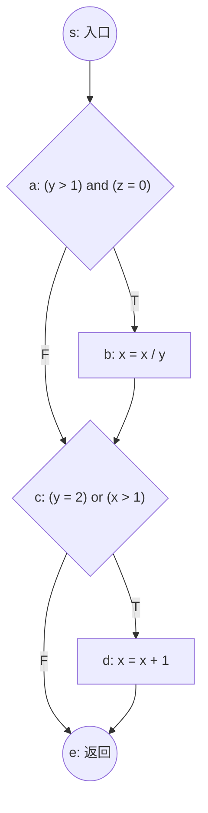

# 第7章04 白盒测试及用例生成

## 6.1 白盒测试概述

白盒测试又称结构测试、逻辑驱动测试、基于程序的测试。

课件指出“白盒测试 = 结构化测试”。

白盒测试定义：一种基于==源程序或代码==的测试方法，依据==源程序或代码结构与逻辑==生成测试用例，以尽可能多地发现并修改源程序错误。

白盒测试两个特点：基于代码；尽可能覆盖实现的行为。

黑盒测试两个特点：基于规约；尽可能覆盖定义的行为。

白盒测试分为静态和动态两种类型0

| **测试类型** | **测试依据**        | **覆盖目标** |
| ------------ | ------------------- | ------------ |
| 黑盒测试     | 规约 / 需求规格说明 | 定义的行为   |
| 白盒测试     | 源代码 / 程序结构   | 实现的行为   |

### 为什么需要白盒测试

1. ==确保每段代码都被执行==，避免相应缺陷；
2. 是黑盒测试 / 功能测试的==补充==；
3. 能覆盖高层规范说明中忽视的==底层细节==；
4. 更容易进行==自动化==测试。

#### 如何实施白盒测试

动态：程序图（CFG）；生成测试用例；执行测试；分析覆盖标准；判定测试结果

进入条件：**编码开始阶段**

退出条件：完成测试计划（满足一定==覆盖率==）；发现并修正了错误；预算和开发时间

| 类型         | 是否执行程序 | 核心内容                                          |
| ------------ | ------------ | ------------------------------------------------- |
| 静态白盒测试 | 不执行       | 有条理地审查软件设计、体系结构和代码              |
| 动态白盒测试 | 执行         | 基于程序控制流/数据流设计用例、执行测试并分析覆盖 |

## 6.2 静态白盒测试

### 静态白盒测试概述

**静态白盒测试**是在**不执行软件**的条件下，有条理地仔细==审查软件设计、体系结构和代码==，从而找出软件缺陷的过程，有时称为**结构化分析**。

实施静态白盒测试的理由

1. **尽早发现软件缺陷**；
2. 为后继测试中**设计测试用例**提供思路。

静态白盒测试可以更早、更低成本地发现缺陷。

#### 静态白盒测试优点

1. 可发现某些机器发现不了的错误；
2. 利用不同人对代码的不同观点；
3. 对照设计，确保程序能完成预期功能；
4. 不但能检测出错误，还可以尝试确定错误根源；
5. 节约计算机资源，但以增加人工成本为代价；
6. 尽早发现缺陷，避免后期缺陷修复造成巨大压力。

#### 易错点

- 静态白盒测试不一定节省人工成本，它通常会增加人工成本；
- 但它能节约计算机资源，并减少后期修复压力。

### 静态白盒测试具体方法

1. 技术评审 technical review；
2. 代码 / 文档阅读 code/document reading；
3. 走查 / 通查 walk through；
4. 专项检查 inspection；
5. 代码 / 数据 / 文档审计 code/data/document audit。

## 6.3 动态白盒测试

特点：不但要提供软件源代码，还要提供可执行程序，测试过程需要**在计算机上执行程序**

动态白盒测试检查是否存在缺陷通过：

• 对程序模块中的所有独立执行路径至少**测试执行**一次

• 对所有逻辑判定的取值（“真”与“假”）都至少**测试执行**一次

• 在上下边界及可操作范围内**测试运行**所有循环

• **测试执行**内部数据结构来检查其有效性

动态白盒测试流程：

1. 构造程序图，如 CFG、PDG；
2. 生成测试用例；
3. 执行测试；
4. 分析覆盖标准；
5. 判定测试结果。

##### 覆盖标准简介

覆盖标准的意义：对执行测试到何时才是充分的的定量回答

覆盖标准的作用：测试软件的一种度量标准，描述程序源代码被测试的==程度==

重要：一种测试技术通常有一种对用的覆盖标准

动态白盒测试方法：

- 基于控制流的方法：语句覆盖，判定覆盖，条件覆盖，路径覆盖
- 基于数据流的方法：数据流测试

## 6.4 控制流测试（一种逻辑覆盖测试）

### 覆盖标准


白盒测试要求对被测程序结构特性达到一定程度覆盖。

| 覆盖准则 | 覆盖要求 | 强弱关系 | 常见误区 |
| -------- | -------- | -------- | -------- |
| 语句覆盖 | 每条语句至少执行一次 | 最弱 | 100% 语句覆盖也可能漏严重缺陷 |
| 判定覆盖/分支覆盖 | 每个判断 True 和 False 至少一次 | 通常包含语句覆盖 | 不一定覆盖每个条件取值 |
| 条件覆盖 | 每个判断中每个条件的 True/False 至少一次 | 与判定覆盖不互相完全替代 | 条件覆盖不能保证所有分支执行 |
| 判定-条件覆盖 | 每个条件取值、每个判定取值都至少覆盖一次 | 强于单独判定或条件覆盖 | 仍不等于条件组合覆盖 |
| 条件组合覆盖 | 每个判定中条件取值组合至少出现一次 | 强于判定-条件覆盖 | 某些条件组合可能不可能 |
| 路径覆盖 | 覆盖程序中所有可能路径 | 很强 | 循环导致路径数可能不可行，也不能替代所有测试 |

课件中还强调：路径覆盖是一种较强覆盖标准，但不能替代条件覆盖和条件组合覆盖。

无论哪种覆盖方法，都**无法绝对保证**程序的正确性




### 语句覆盖（所有节点覆盖）

**语句覆盖 Statement Coverage** 是指选择足够的测试用例，使得运行这些测试用例时，被测程序的**每条可执行语句**都至少执行一次。

语句覆盖是最弱的逻辑覆盖准则之一。

100%的语句覆盖可能很困难：处理错误的代码片段；小概率事件；不可达代码

==即使达到 100% 语句覆盖，也可能发现不了严重问题。==

| 用例 | 输入 `(y,z,x)` | 执行过程                                       | 路径     | 预期输出 `(y,z,x)` | 覆盖说明            |
| ---- | -------------- | ---------------------------------------------- | -------- | ------------------ | ------------------- |
| SC-1 | `(2,0,4)`      | a=True，执行 `x=4/2=2`；c=True，执行 `x=2+1=3` | `sabcde` | `(2,0,3)`          | b、d 两条语句均执行 |

### 判定覆盖（分支覆盖/所有边覆盖）

**判定覆盖 Decision Coverage**，也称分支覆盖，是指选择足够的测试用例，使得运行这些测试用例时，被测程序的**每个判定的所有可能结果都至少执行一次**。（每个判断至少获得一次 True 和一次 False。）

优点：简单！包含语句覆盖并且避免了部分语句覆盖的问题。

缺点：==忽略了表达式内的条件，不能发现每个条件的错误==

| 用例 | 输入 `(y,z,x)` | 判定 a | 判定 c | 路径     | 预期输出 `(y,z,x)` | 覆盖说明              |
| ---- | -------------- | ------ | ------ | -------- | ------------------ | --------------------- |
| DC-1 | `(2,0,4)`      | T      | T      | `sabcde` | `(2,0,3)`          | 覆盖 a=True、c=True   |
| DC-2 | `(1,1,1)`      | F      | F      | `sace`   | `(1,1,1)`          | 覆盖 a=False、c=False |

### 条件覆盖

**条件覆盖**保证**每个**判断中的**每个**条件的取值至少满足一次。

测试用例需要让每个原子条件都至少取到一次 True 和 False。

==条件覆盖不能保证程序所有分支都被执行。==

| 用例 | 输入 `(y,z,x)` | A1: `y>1` | A2: `z=0` | C1: `y=2` | C2: `x>1` | 判定 a | 判定 c | 路径    | 预期输出 `(y,z,x)` |
| ---- | -------------- | --------- | --------- | --------- | --------- | ------ | ------ | ------- | ------------------ |
| CC-1 | `(1,0,3)`      | F         | T         | F         | T         | F      | T      | `sacde` | `(1,0,4)`          |
| CC-2 | `(2,1,1)`      | T         | F         | T         | F         | F      | T      | `sacde` | `(2,1,2)`          |

### 判定条件覆盖

**判定条件覆盖**要求每个判定的所有可能结果至少执行一次，并且**每个判定中的每个条件的所有可能结果**也至少出现一次。

也就是同时满足：判定覆盖；条件覆盖。

错误屏蔽：指==原子条件取值改变不会影响判定结果==，因此该条件上的取值错误是不可见的。

引发测试屏蔽的组合在测试过程中可以忽略不计：==T OR ；F AND==

==100%覆盖但无法检测出运算符错误==

| 用例  | 输入 `(y,z,x)` | A1: `y>1` | A2: `z=0` | C1: `y=2` | C2: `x>1` | 判定 a | 判定 c | 路径     | 预期输出 `(y,z,x)` |
| ----- | -------------- | --------- | --------- | --------- | --------- | ------ | ------ | -------- | ------------------ |
| DCC-1 | `(2,0,4)`      | T         | T         | T         | T         | T      | T      | `sabcde` | `(2,0,3)`          |
| DCC-2 | `(1,1,1)`      | F         | F         | F         | F         | F      | F      | `sace`   | `(1,1,1)`          |

### 条件组合覆盖

#### 情形1：每个判定中条件的各种可能组合至少出现一次

```
x > 3 OR y < 5
```

两个条件共有四种组合：

1. T OR T；
2. T OR F；
3. F OR T；
4. F OR F。

#### 情形2：所有条件的所有可能取值组合至少出现一次

如果程序中有 n 个原子条件，则组合数可能是：$$ 2^n $$

条件组合覆盖很强，但：

1. 组合数可能指数级增长；
2. 某些条件组合不存在；
3. 仍可能出现错误屏蔽；
4. 不一定覆盖所有路径。

| 用例  | 输入 `(y,z,x)` | A1: `y>1` | A2: `z=0` | C1: `y=2` | C2: `x>1` | 判定 a | 判定 c | 路径     | 预期输出 `(y,z,x)` |
| ----- | -------------- | --------- | --------- | --------- | --------- | ------ | ------ | -------- | ------------------ |
| MCC-1 | `(2,0,4)`      | T         | T         | T         | T         | T      | T      | `sabcde` | `(2,0,3)`          |
| MCC-2 | `(2,1,1)`      | T         | F         | T         | F         | F      | T      | `sacde`  | `(2,1,2)`          |
| MCC-3 | `(3,0,6)`      | T         | T         | F         | T         | T      | T      | `sabcde` | `(3,0,3)`          |
| MCC-4 | `(3,0,0)`      | T         | T         | F         | F         | T      | F      | `sabce`  | `(3,0,0)`          |
| MCC-5 | `(3,1,0)`      | T         | F         | F         | F         | F      | F      | `sace`   | `(3,1,0)`          |
| MCC-6 | `(3,1,2)`      | T         | F         | F         | T         | F      | T      | `sacde`  | `(3,1,3)`          |
| MCC-7 | `(1,0,2)`      | F         | T         | F         | T         | F      | T      | `sacde`  | `(1,0,3)`          |
| MCC-8 | `(1,1,0)`      | F         | F         | F         | F         | F      | F      | `sace`   | `(1,1,0)`          |

### 路径覆盖

**路径覆盖 Path Coverage** 是指选择足够的测试用例，保证每条**可能执行到的路径**都至少经过一次。

如果包含环路，每条环路至少经过一次

路径覆盖实际上考虑了程序中各种判定结果的所有可能组合，但它未必能覆盖判定中条件结果的各种可能情况。

优点：相对彻底的测试

缺点：路径条数可能以分支的指数级增加；不可达路径存在

路径覆盖考虑了各种判定结果的所有可能组合，但未必能覆盖判定中==条件结果的各种可能情况==

路径覆盖是一种比较强的覆盖标准，==但不能替代条件覆盖和条件组合覆盖==。

| 用例 | 输入 `(y,z,x)` | 判定 a | 判定 c | 路径     | 预期输出 `(y,z,x)` |
| ---- | -------------- | ------ | ------ | -------- | ------------------ |
| PC-1 | `(2,0,4)`      | T      | T      | `sabcde` | `(2,0,3)`          |
| PC-2 | `(3,0,3)`      | T      | F      | `sabce`  | `(3,0,1)`          |
| PC-3 | `(1,0,2)`      | F      | T      | `sacde`  | `(1,0,3)`          |
| PC-4 | `(1,0,1)`      | F      | F      | `sace`   | `(1,0,1)`          |

| **覆盖准则** | **覆盖对象**            | **强弱特点**               |
| ------------ | ----------------------- | -------------------------- |
| 语句覆盖     | 每条语句                | 最弱                       |
| 判定覆盖     | 每个分支 True/False     | 强于语句覆盖               |
| 条件覆盖     | 每个原子条件 True/False | 不一定包含判定覆盖         |
| 判定条件覆盖 | 判定结果 + 条件结果     | 同时满足判定和条件覆盖     |
| 条件组合覆盖 | 条件取值组合            | 更强，但代价高             |
| 路径覆盖     | 执行路径                | 强，但不能替代条件组合覆盖 |


## 6.5 基本路径测试

基本路径测试思想：寻找==基本路径==，根据基本路径构造测试用例，保证每条==基本路径==至少执行一次。

测试用例设计过程：源程序 / PDL → 控制流图 CFG → 圈复杂度 → 基本路径 → 测试用例

### 控制流图 CFG

控制流图用于描述程序中的==逻辑控制流==：

- 结点：一个或多个过程语句；
- 边：控制流。
- 域：由边和结点限定的区间

### 基本路径

基本路径，又称独立程序路径，是指任何一条贯穿程序的路径，该**路径至少包含一条不同于其他路径的边**。

==基本路径的条数由圈复杂度确定==

- 基本路径集合中路径条数唯一，但基本路径集合本身可以不唯一；
- 其他路径可以通过基本路径运算得到；
- 基本路径集合大小由圈复杂度确定。

课件强调两个核心特性：

1. **基本路径集合中路径条数唯一，但基本路径可以不一样。**
2. **其他路径可以通过基本路径运算得到。**

| 基本路径 | 路径     | 覆盖的新边或新结构        |
| -------- | -------- | ------------------------- |
| P1       | `sabcde` | 覆盖 a=True、b、c=True、d |
| P2       | `sabce`  | 覆盖 c=False              |
| P3       | `sace`   | 覆盖 a=False              |

### 圈复杂度——基本路径的度量

**圈复杂度**度量基本路径数，是所有语句被执行一次所需测试用例数的**上限之一，**即执行所有基本路径即可实现100%语句覆盖

基本路径覆盖不等于分支覆盖。

基本路径测试与第6章圈复杂度相连：

$$
V(G)=E-N+2P
$$

单连通 CFG 常用：

$$
V(G)=E-N+2
$$

也可用：

$$
V(G)=J+1
$$

其中 $J$ 是判定节点数。

主观题答题步骤：

1. 根据代码或 PDL 画 CFG。
2. 标出节点和边。
3. 计算圈复杂度，确定基本路径条数。
4. 列出一组基本路径集合。
5. 为每条基本路径设计测试用例。

注意：课件明确指出“基本路径覆盖 != 分支覆盖”，但也给出“基本路径覆盖 -> 分支覆盖”方向关系。答题时不要简单互换。

**基本路径集寻找算法？**

Step1: 确认从入口到出口的最短路径。

Step2:从入口到第1个未被先后评估为真和假两种结果的条件语句。

Step3:改变该条件语句的判断值。

Step4:按最短路径从这个条件语句到出口。

Step5:重复步骤2-5,直到所有基本路径都被找到

基本路径特性：

1.==其他路径可以通过基本路径运算得到==

2.==基本路径集合中路径条数唯一，基本路径可以不一样==

当程序中出现循环时，基本路径的边可以重复出现！但通常将循环视为执行0次或1次两种情况

abef执行0次

abebef执行1次

| 合法基本路径集合           |
| -------------------------- |
| `sabcde`, `sabce`, `sace`  |
| `sabcde`, `sacde`, `sace`  |
| `sabcde`, `sabce`, `sacde` |

| 基本路径     | 输入 `(y,z,x)` | 执行说明                         | 预期输出 `(y,z,x)` |
| ------------ | -------------- | -------------------------------- | ------------------ |
| P1: `sabcde` | `(2,0,4)`      | a=True，x=4/2=2；c=True，x=2+1=3 | `(2,0,3)`          |
| P2: `sabce`  | `(3,0,3)`      | a=True，x=3/3=1；c=False，不加 1 | `(3,0,1)`          |
| P3: `sace`   | `(1,0,1)`      | a=False，不除；c=False，不加 1   | `(1,0,1)`          |

## 6.6 循环测试

课件将循环分为四种：

1. 简单循环；
2. 嵌套循环；
3. 串接循环；
4. 非结构循环。

### 简单循环测试

对简单循环，应构造以下测试用例：

1. 跳过整个循环，即执行 0 次循环；
2. 只执行 1 次循环；
3. 执行 2 次循环；
4. 执行 m 次循环，其中 $m<n$；
5. 执行 $n-1$、$n$、$n+1$ 次循环。

其中 n 表示循环允许的最大次数。

适用边界值测试的 $6n+1$ 公式。

### 嵌套循环测试

1. 先测试最内层循环：
   - 所有外层循环变量置为最小值；
   - 最内层按==简单循环测试==。
2. 由里向外，测试上层循环：
   - 此层以外的所有外层循环变量取最小值；
   - 此层以内的所有嵌套内层循环变量取典型值；
   - 当前层按简单循环测试。
3. 重复上一条规则，直到所有层循环测试完毕。
4. 对全部各层循环同时取最小循环次数，或者同时取最大循环次数。

嵌套循环测试顺序：先内后外，外层取最小，内层取典型。

### 串接循环测试

串接循环分两种情况。

#### 情况1：各循环互相独立

如果串接的各个循环互相独立：

分别用简单循环的方法进行测试。

#### 情况2：循环之间不独立

如果两个循环不独立，例如第一个循环变量与第二个循环控制相关：

把第一个循环看作外循环，第二个循环看作内循环，用嵌套循环方法处理。

### 非结构循环测试

非结构循环应该先将其结构化，然后再测试。重复编码法。

| **循环类型**   | **测试方法**                 |
| -------------- | ---------------------------- |
| 简单循环       | 0、1、2、m、n-1、n、n+1 次   |
| 嵌套循环       | 先内后外，外层最小，内层典型 |
| 独立串接循环   | 分别按简单循环测试           |
| 不独立串接循环 | 按嵌套循环处理               |
| 非结构循环     | 先结构化，再测试             |

## 6.7 数据流测试

### 定义

数据流是==变量的定义或使用顺序和变量可能状态的一种抽象表示==。变量状态可以是创建/定义、使用、清除/销毁等。

数据流测试是一种面向==变量定义位置到使用位置覆盖==的基于程序结构的测试方法，重点关注变量的定义与使用。

它重点关注：

- 变量在哪里被定义；
- 变量在哪里被使用；
- 从定义到使用之间变量值如何变化；
- 是否存在与变量定义和使用相关的 Bug。

#### 可发现的问题

- 变量未初始化就被读取；
- 变量定义后从未使用；
- 变量被错误赋值；
- 定义和使用之间路径异常。

### 与路径测试区别

| 方法 | 分析角度 |
| ---- | -------- |
| 路径测试 | 从控制流、逻辑覆盖角度分析 |
| 数据流测试 | 从变量定义和使用覆盖角度分析 |

课件指出：数据流测试可认为是路径测试的“真实性”检查，是对路径测试的一种改良。

| **对比项** | **路径测试**         | **数据流测试**          |
| ---------- | -------------------- | ----------------------- |
| 分析角度   | 控制流 / 逻辑覆盖    | 数据流 / 变量定义与使用 |
| 路径含义   | ==程序潜在执行路径== | ==变量定义-使用路径==   |
| 关注对象   | 分支、判定、执行路线 | 变量的定义、使用和传播  |
| 作用       | 检查控制结构覆盖     | 检查变量赋值、使用错误  |
| 类比       | 检测道路             | 检测车辆                |

### 数据流测试基本思想

程序是对数据的加工处理过程，因此可以从数据==处理流程==角度进行测试。

数据处理流程对应：数据流图 DFG。

数据流图类似控制流图 CFG，但更详细描述变量的：创建；使用；销毁。

数据流测试步骤：

1. 对给定程序构造数据流图；
2. 找出所有变量的定义-使用路径；
3. 考察测试用例对这些路径的覆盖程度，作为衡量测试效果的度量值。

### 基本概念

**1. P**：P 表示程序。

**2. G(P)**：G(P) 表示程序 P 的数据流图。

**3. V**：V 表示变量集合。

例如课件示例程序中：
$$
V={staffDiscount,\ totalPrice,\ finalPrice,\ discount,\ price}
$$
**4. PATH(P)**：PATH(P) 表示程序 P 的所有路径集合。

| 概念 | 含义 |  |
| ---- | ---- | ---- |
| DEF(v,n) | 在节点 n 定义变量 v | input x; x = 2; |
| USE(v,n) | 在节点 n 使用变量 v | print x; a = 2 + x; |
| P-use | 谓词使用，变量在谓词中被使用 | if b > 6 |
| C-use | 计算使用，变量在计算中被使用 | x = 3 + b |
| O-use | 输出使用，变量值被输出到屏幕/打印机 | print、输出 |
| L-use | 定位使用，变量值用于定位数组位置等 | 数组下标、定位 |
| I-use | 迭代使用，变量值用于控制循环次数 | 控制循环次数 |
| DU-path | DU 路径：从变量定义节点到使用节点的路径<br />从变量被定义的位置，到变量被使用的位置，中间形成的路径就是 DU-path。 | 定义-使用路径 |
| DC-path | DC 路径：定义-清洁路径，除起始定义节点外没有其他定义节点<br />从定义到使用之间，变量没有被重新定义。 | 定义-清洁路径 |

### 数据（覆盖）流测试步骤

课件步骤：

1. 对给定程序构造程序数据流图；
2. 找出所有变量的定义-使用路径。
3. 考察测试用例对这些路径的覆盖程度，即可作为衡量测试效果的度量值。

考试可展开为：

1. 标出每个变量的定义节点 DEF；
2. 标出每个变量的使用节点 USE，并区分 P-use 与 C-use；
3. 枚举可能的 DU 路径；
4. 去除不满足定义清洁的路径；
5. 根据覆盖准则选择路径；
6. 为路径设计测试用例。

### Rapps-Weyuker 覆盖标准

目标包括：

1. 保证所选路径数目总是有限的 / 可被实际处理的；
2. 寻找系统化的测试路径选择方案，以帮助发现未知缺陷。

Rapps-Weyuker覆盖9条标准

| 标准 | 含义 |
| ---- | ---- |
| All-Paths | 所有路径覆盖 |
| All-Edges | 所有边覆盖，等价于分支覆盖 |
| All-Nodes | 所有节点覆盖，等价于语句覆盖 |
| All-Defs | 每个变量的每个定义节点都有 dc-path 到达某个使用节点<br />每个定义至少到达一个使用。 |
| All-P-Uses | 每个定义节点都有 dc-path 到达每个 P-use 节点<br />每个定义到达所有谓词使用。 |
| All-P-Uses/Some C-Uses | 若无可达 P-use，则至少到达一个 C-use<br />优先覆盖所有 P-use；没有 P-use 时至少覆盖一个 C-use。 |
| All-C-Uses/Some P-Uses | 若无可达 C-use，则至少到达一个 P-use<br />优先覆盖所有 C-use；没有 C-use 时至少覆盖一个 P-use。 |
| All-Uses | 每个定义节点到达该变量每个使用节点<br />每个定义到达每个使用，但每对定义-使用只需一条 dc-path。 |
| All-DU-Paths | 覆盖所有定义-使用路径集合<br />每个定义到每个使用的所有定义清洁路径都覆盖，是更强的数据流覆盖。 |

课件还列出 Ntafos、Ural、Laski-Korel 标准，但本次文本重点展开的是 Rapps-Weyuker 九条。


### 数据流测试优点和缺点

#### 优点

1. 揭示隐藏在代码**变量定义和使用**中的各种错误；
2. 可以覆盖所有语句、所有分支、所有路径；
3. **对代码测试比较彻底**。

#### 缺点

1. 无法检测代码中**不可达路径**；
2. 不验证需求规格。

## 6.8 数据流测试主观题模板

如果题目给代码片段或流程图：

1. 画或整理 CFG/DFG。
2. 对每个变量分别列 DEF 节点。
3. 对每个变量分别列 USE 节点，并标注 P-use/C-use。
4. 枚举 DEF 到 USE 的候选路径。
5. 删除非定义清洁路径。
6. 按题目要求选择 All-Defs、All-Uses 或 All-DU-Paths 等标准。
7. 写测试路径和测试数据。

常见扣分点：

- 把变量定义和使用混淆；
- 不区分谓词使用和计算使用；
- DU 路径中间又重新定义了变量，却仍当成有效 DU 路径；
- 只写路径，不写测试用例。

## 6.9 白盒测试主观题方法总表

| 方法 | 适用场景 | 解题步骤 | 常见扣分点 |
| ---- | -------- | -------- | ---------- |
| 语句/分支/条件覆盖 | 给代码或流程图，要求达到某覆盖准则 | 找判定和条件，设计输入覆盖目标 | 误以为语句覆盖等于充分测试 |
| 条件组合覆盖 | 多条件判断 | 枚举可行条件组合，删除不可能组合 | 把不可行组合也算入用例 |
| 路径覆盖 | 小规模控制流 | 枚举路径并设计用例 | 循环路径无限展开 |
| 基本路径测试 | 给 CFG/PDL | 画 CFG，算圈复杂度，列基本路径，设计用例 | 圈复杂度公式用错 |
| 数据流测试 | 关注变量定义使用 | 找 DEF/USE，列 DU 路径，按准则选路径 | 不检查定义清洁 |

## 6.10 小测关联

第二次小测已考：

- 结构化测试包括控制流测试和数据流测试；
- 数据流覆盖标准包括 All-Paths、All-Edges、All-Nodes、All-Defs、All-P-Uses、All-P-Uses/Some C-Uses、All-C-Uses/Some P-Uses、All-Uses、All-DU-Paths；
- 黑盒与白盒辨析。

## 6.11 本章复习检查题

### 填空题

1. 白盒测试又称________测试、逻辑驱动测试、基于程序的测试。
2. 数据流测试重点关注变量的________与________。
3. P-use 是________使用，C-use 是________使用。

### 选择题

1. 保证每个判断 True 和 False 至少一次的是：A. 语句覆盖 B. 判定覆盖 C. 条件覆盖 D. All-Defs
2. All-Nodes 等价于：A. 语句覆盖 B. 分支覆盖 C. 路径覆盖 D. 条件组合覆盖

### 判断题

1. 条件覆盖一定能保证所有分支都被执行。
2. 数据流测试可以发现定义-使用异常。
3. 基本路径集合中路径条数由圈复杂度确定。

### 参考答案

1. 填空：结构；定义、使用；谓词、计算。
2. 选择：B；A。
3. 判断：错；对；对。


## 6.12 第7章04 客观题必背清单

### A. 填空题重点

1. 白盒测试等价于结构化测试。
2. 白盒测试两个特点：基于代码、尽可能覆盖实现的行为。
3. 黑盒测试两个特点：基于规约、尽可能覆盖定义的行为。
4. 白盒测试又称结构测试、逻辑驱动测试、基于程序的测试。
5. 白盒测试分为静态白盒测试和动态白盒测试。
6. 静态白盒测试是在不执行软件的条件下审查设计、体系结构和代码。
7. 静态白盒测试方法包括技术评审、代码/文档阅读、走查、专项检查、审计。
8. 动态白盒测试需要源代码和可执行程序，并需要执行程序。
9. 覆盖标准是对“测试执行到何时才充分”的定量回答。
10. 控制流覆盖测试包括语句覆盖、判定覆盖、条件覆盖、判定条件覆盖、条件组合覆盖、路径覆盖。
11. 语句覆盖要求每条可执行语句至少执行一次。
12. 判定覆盖又称分支覆盖，要求每个判定 True 和 False 至少一次。
13. 条件覆盖要求每个判定中的每个条件取值至少满足一次。
14. 判定条件覆盖同时要求判定结果和条件结果都覆盖。
15. 条件组合覆盖要求条件取值组合至少出现一次。
16. 路径覆盖要求每条可能执行路径至少执行一次。
17. 基本路径又称独立程序路径。
18. 圈复杂度可用 $V(G)=E-N+2$ 计算。
19. 圈复杂度也等于判定结点数 + 1。
20. 圈复杂度也等于区域数量。
21. 简单循环测试包括 0、1、2、m、n-1、n、n+1 次。
22. 数据流测试面向变量定义位置、使用位置覆盖。
23. DEF(v,n) 表示在节点 n 定义变量 v。
24. USE(v,n) 表示在节点 n 使用变量 v。
25. P-use 是谓词使用，C-use 是计算使用。
26. DU-path 是定义-使用路径。
27. DC-path 是定义-清洁路径。
28. All-Paths 等价于路径覆盖。
29. All-Edges 等价于分支覆盖。
30. All-Nodes 等价于语句覆盖。
31. All-Defs 要求每个变量每个定义至少到达某个使用。
32. All-Uses 要求每个定义到每个使用至少一条 dc-path。
33. All-DU-Paths 要求每个定义到每个使用的所有 dc-path。

------

### B. 选择题重点

| **问法**                 | **答案方向**                               |
| ------------------------ | ------------------------------------------ |
| 白盒测试依据是什么？     | 源程序、代码结构、代码逻辑                 |
| 白盒测试有哪些别名？     | 结构测试、逻辑驱动测试、基于程序的测试     |
| 哪些属于静态白盒测试？   | 技术评审、代码阅读、走查、专项检查、审计   |
| 哪些属于控制流覆盖准则？ | 语句、判定、条件、判定条件、条件组合、路径 |
| 哪个覆盖准则最弱？       | 语句覆盖                                   |
| 判定覆盖又叫什么？       | 分支覆盖、所有边覆盖                       |
| 条件覆盖关注什么？       | 每个原子条件 True/False                    |
| 条件组合覆盖关注什么？   | 条件取值组合                               |
| 路径覆盖的缺点是什么？   | 路径爆炸、不可达路径                       |
| 圈复杂度计算方法有哪些？ | 区域数、E-N+2、判定结点数+1                |
| 基本路径条数由什么决定？ | 圈复杂度                                   |
| 简单循环测试哪些次数？   | 0、1、2、m、n-1、n、n+1                    |
| 数据流测试关注什么？     | 变量定义和使用                             |
| P-use 出现在哪里？       | 条件判断 / 谓词                            |
| C-use 出现在哪里？       | 计算表达式                                 |
| All-Nodes 等价于什么？   | 语句覆盖                                   |
| All-Edges 等价于什么？   | 分支覆盖                                   |
| All-Paths 等价于什么？   | 路径覆盖                                   |

### C. 判断题易错点

| **说法**                                    | **正误** | **原因**                                 |
| ------------------------------------------- | -------- | ---------------------------------------- |
| 白盒测试等价于结构化测试                    | 对       | 课件明确说明                             |
| 白盒测试基于规约，黑盒测试基于代码          | 错       | 反了                                     |
| 白盒测试是黑盒测试的补充                    | 对       | 可覆盖底层实现细节                       |
| 静态白盒测试需要执行程序                    | 错       | 不执行软件                               |
| 动态白盒测试需要执行程序                    | 对       | 需要可执行程序                           |
| 100%语句覆盖可以保证程序正确                | 错       | 仍可能遗漏严重错误                       |
| 判定覆盖包含语句覆盖                        | 对       | 分支覆盖比语句覆盖强                     |
| 条件覆盖一定包含判定覆盖                    | 错       | 条件都覆盖了，整体判定可能未取到两种结果 |
| 判定条件覆盖同时满足判定覆盖和条件覆盖      | 对       | 两者都要求                               |
| 条件组合覆盖一定覆盖所有路径                | 错       | 课件明确提出疑问和限制                   |
| 路径覆盖能替代条件组合覆盖                  | 错       | 路径覆盖未必覆盖条件结果组合             |
| 路径覆盖可能遇到路径爆炸                    | 对       | 分支指数级增长                           |
| 基本路径集合唯一                            | 错       | 条数唯一，集合可以不同                   |
| 圈复杂度越高，模块越可能有错误              | 对       | 是测试关注焦点                           |
| 顺序节点合并会改变圈复杂度                  | 错       | 课件说明不影响                           |
| 数据流测试不验证需求规格                    | 对       | 这是其缺点                               |
| 数据流异常一定导致程序失效                  | 错       | 需进一步检查确认                         |
| All-Defs 检查每个变量的每个定义是否都有使用 | 对       | 每个定义至少到某个使用                   |
| All-DU-Paths 比 All-Uses 更强               | 对       | 覆盖所有 dc-path                         |

## 6.13 第7章04 主观题可能考法

### 情景1：给代码或流程图，判断覆盖准则

答题模板：

1. 找出所有语句；
2. 找出所有判定；
3. 找出每个判定中的原子条件；
4. 根据题目要求判断：
   - 语句覆盖：是否每条语句执行；
   - 判定覆盖：每个判定 True/False 是否覆盖；
   - 条件覆盖：每个条件 True/False 是否覆盖；
   - 判定条件覆盖：判定和条件是否都覆盖；
   - 条件组合覆盖：条件组合是否全覆盖；
   - 路径覆盖：路径是否全覆盖。

------

### 情景2：给程序，要求基本路径测试

答题模板：

1. 画控制流图 CFG；
2. 统计边数 E、结点数 N，或统计判定结点 P；
3. 计算圈复杂度：
    $$
    V(G)=E-N+2
    $$
    或：
    $$
    V(G)=P+1
    $$
4. 确定基本路径数量；
5. 列出基本路径集合；
6. 为每条基本路径设计测试用例；
7. 写出预期输出。

------

### 情景3：给循环结构，设计循环测试用例

答题模板：

1. 判断循环类型：
   - 简单循环；
   - 嵌套循环；
   - 串接循环；
   - 非结构循环。
2. 简单循环测：
   - 0次；
   - 1次；
   - 2次；
   - m次；
   - n-1、n、n+1次。
3. 嵌套循环：
   - 先测最内层；
   - 外层取最小；
   - 内层取典型；
   - 由里向外测试。
4. 串接循环：
   - 独立则分别测；
   - 不独立则按嵌套循环处理。
5. 非结构循环：
   - 先结构化，再测试。

------

### 情景4：给代码片段，要求数据流测试

答题模板：

1. 写出变量集合 V；
2. 对指定变量 v 找定义节点 DEF(v,n)；
3. 找使用节点 USE(v,n)；
4. 判断使用类型：
   - P-use；
   - C-use；
   - O-use；
   - L-use；
   - I-use。
5. 列出 DU-path；
6. 判断哪些是 DC-path；
7. 根据覆盖准则选择测试路径；
8. 设计测试用例。

------

## 6.14 第7章04 最终记忆主线

这一章可以用一句话概括：

白盒测试是基于代码结构和程序逻辑的测试，分为静态白盒测试和动态白盒测试；静态白盒测试通过评审、阅读、走查、检查和审计发现缺陷；动态白盒测试通过控制流覆盖、基本路径、循环测试和数据流测试生成测试用例并评估测试充分性。

最需要优先掌握的是：

1. **白盒测试 = 结构化测试**；
2. **白盒测试基于代码，黑盒测试基于规约**；
3. **静态白盒测试定义、优点和方法**；
4. **动态白盒测试流程与覆盖标准意义**；
5. **六种控制流覆盖准则定义和区别**；
6. **语句覆盖、判定覆盖、条件覆盖、判定条件覆盖、条件组合覆盖、路径覆盖的易错关系**；
7. **基本路径、独立路径、圈复杂度三种计算方法**；
8. **简单循环、嵌套循环、串接循环、非结构循环的测试方法**；
9. **数据流测试中的 DEF、USE、P-use、C-use、DU-path、DC-path**；
10. **Rapps 和 Weyuker 的 All-Defs、All-Uses、All-DU-Paths 等覆盖标准**。
